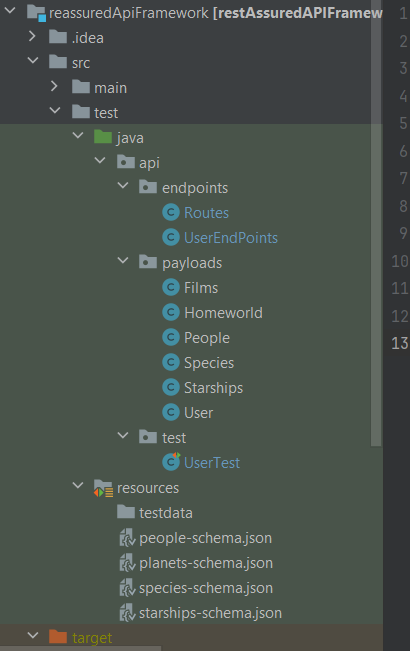
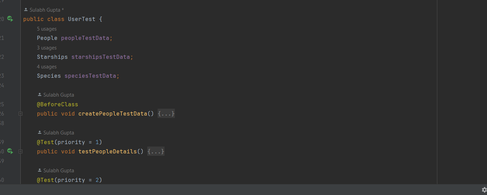

# Testng API Automation framework using Rest Assured

This repository contains a TestNG-based testing framework used for Automating the APIs using rest assured Library.
This documnent will provide the details of the framework and how to run the test cases.

## Pre-requisite

1) Java 8 or above
2) Maven

## Framework Structure

1) Test cases are written under test folder(UserTest file)
2) URL are added under endpoints folder(Routes file)
3) Code to hit Endpoints are present under endpoints folder(UserEndPoints File)
4) POJO are created under Payloads folder
5) Schema Json files are added under resources

Test case file:

